# Sudoku Solver

[Cuarto proyecto](https://www.freecodecamp.org/learn/quality-assurance/quality-assurance-projects/sudoku-solver) requisito obligatorio para obtener la **Quality Assurance Certification**

El proyecto consiste en la realización de un solucionador de sudokus a partir del ingreso del sudoku como cadena de texto en la que los valores vacíos del sudoku se representan como puntos(.) en el string. El string se envía en una petición POST al servidor y este responde con la solución o con errores descriptivos. Si el sudoku que representa la cadena de texto no es válido ya sea en los siguientes casos:

- Cadena vacía

- No esta compuesto de números del 1 al 9 ó de puntos

- Posee un largo distinto de 81 caracteres

- Posee números en posiciones que violan las reglas de sudokus ya sea números repetidos en filas, columnas o área.

Entonces se muestra un mensaje señalando los errores siguientes para cada caso:

- Required field missing

- Invalid characters in puzzle

- Expected puzzle to be 81 characters long

- Puzzle cannot be solved

Se implementa un **Backtracking Algorithm** para la resolución de sudokus el cual va probando todos los valores posibles para cada posición vacía y "devolviéndose" en caso de que el sudoku no sea válido en alguna rama. La cadena de caracteres válida se convierte en un array de arrays el cual facilita el recorrido por filas y columnas de una matriz de valores para luego pasar la matriz al algoritmo y este va modificando dicha matriz con valores válidos.

Por último, he creado **12 tests unitarios** y **14 tests funcionales** los cuales todos han sido superados.

## Tabla de Contenidos

- [Sudoku Solver](#sudoku-solver)
  - [Tabla de Contenidos](#tabla-de-contenidos)
  - [Deploy](#deploy)
  - [Requisitos Aprobados](#requisitos-aprobados)
  - [Tests Requeridos](#tests-requeridos)
  - [Proyecto Aprobado](#proyecto-aprobado)
  - [Tests Requeridos Aprobados](#tests-requeridos-aprobados)
  - [Código de tests unitarios y funcionales](#código-de-tests-unitarios-y-funcionales)
    - [1. Tests Unitarios](#1-tests-unitarios)
      - [1.1. Logic handles a valid puzzle string of 81 characters](#11-logic-handles-a-valid-puzzle-string-of-81-characters)
      - [1.2.Logic handles a puzzle string with invalid characters (not 1-9 or .)](#12logic-handles-a-puzzle-string-with-invalid-characters-not-1-9-or-)
      - [1.3.Logic handles a puzzle string that is not 81 characters in length](#13logic-handles-a-puzzle-string-that-is-not-81-characters-in-length)
      - [1.4.Logic handles a valid row placement](#14logic-handles-a-valid-row-placement)
      - [1.5.Logic handles an invalid row placement](#15logic-handles-an-invalid-row-placement)
      - [1.6.Logic handles a valid column placement](#16logic-handles-a-valid-column-placement)
      - [1.7.Logic handles an invalid column placement](#17logic-handles-an-invalid-column-placement)
      - [1.8.Logic handles a valid region (3x3 grid) placement](#18logic-handles-a-valid-region-3x3-grid-placement)
      - [1.9.Logic handles an invalid region (3x3 grid) placement](#19logic-handles-an-invalid-region-3x3-grid-placement)
      - [1.10.Valid puzzle strings pass the solver](#110valid-puzzle-strings-pass-the-solver)
      - [1.11.Invalid puzzle strings fail the solver](#111invalid-puzzle-strings-fail-the-solver)
      - [1.12.Solver returns the expected solution for an incomplete puzzle](#112solver-returns-the-expected-solution-for-an-incomplete-puzzle)
    - [2. Tests Funcionales](#2-tests-funcionales)
      - [2.1. Solve a puzzle with valid puzzle string: POST request to /api/solve](#21-solve-a-puzzle-with-valid-puzzle-string-post-request-to-apisolve)
      - [2.2.Solve a puzzle with missing puzzle string: POST request to /api/solve](#22solve-a-puzzle-with-missing-puzzle-string-post-request-to-apisolve)
      - [2.3.Solve a puzzle with invalid characters: POST request to /api/solve](#23solve-a-puzzle-with-invalid-characters-post-request-to-apisolve)
      - [2.4.Solve a puzzle with incorrect length: POST request to /api/solve](#24solve-a-puzzle-with-incorrect-length-post-request-to-apisolve)
      - [2.5. Solve a puzzle that cannot be solved: POST request to /api/solve](#25-solve-a-puzzle-that-cannot-be-solved-post-request-to-apisolve)
      - [2.6.Check a puzzle placement with all fields: POST request to /api/check](#26check-a-puzzle-placement-with-all-fields-post-request-to-apicheck)
      - [2.7.Check a puzzle placement with single placement conflict: POST request to /api/check](#27check-a-puzzle-placement-with-single-placement-conflict-post-request-to-apicheck)
      - [2.8.Check a puzzle placement with multiple placement conflicts: POST request to /api/check](#28check-a-puzzle-placement-with-multiple-placement-conflicts-post-request-to-apicheck)
      - [2.9.Check a puzzle placement with all placement conflicts: POST request to /api/check](#29check-a-puzzle-placement-with-all-placement-conflicts-post-request-to-apicheck)
      - [2.10.Check a puzzle placement with missing required fields: POST request to /api/check](#210check-a-puzzle-placement-with-missing-required-fields-post-request-to-apicheck)
      - [2.11.Check a puzzle placement with invalid characters: POST request to /api/check](#211check-a-puzzle-placement-with-invalid-characters-post-request-to-apicheck)
      - [2.12.Check a puzzle placement with incorrect length: POST request to /api/check](#212check-a-puzzle-placement-with-incorrect-length-post-request-to-apicheck)
      - [2.13.Check a puzzle placement with invalid placement coordinate: POST request to /api/check](#213check-a-puzzle-placement-with-invalid-placement-coordinate-post-request-to-apicheck)
      - [2.14.Check a puzzle placement with invalid placement value: POST request to /api/check](#214check-a-puzzle-placement-with-invalid-placement-value-post-request-to-apicheck)
  - [Screenshots](#screenshots)
    - [1. Home Page Initial Load](#1-home-page-initial-load)
    - [2. Ejemplo de Sudoku Resuelto](#2-ejemplo-de-sudoku-resuelto)
    - [3. String Sudoku Inválido por Largo](#3-string-sudoku-inválido-por-largo)
    - [4.String Sudoku Inválido por caracter no válido](#4string-sudoku-inválido-por-caracter-no-válido)
    - [5. String Sudoku Faltante](#5-string-sudoku-faltante)
    - [6. String Sudoku Inválido violación de Reglas de Sudoku](#6-string-sudoku-inválido-violación-de-reglas-de-sudoku)
    - [7. Valor en coordenada inválido por repetición en fila y columna](#7-valor-en-coordenada-inválido-por-repetición-en-fila-y-columna)
    - [8. Valor en coordenada inválido por repetición en fila, columna y área](#8-valor-en-coordenada-inválido-por-repetición-en-fila-columna-y-área)
    - [9. Coordenada ingresada inválida](#9-coordenada-ingresada-inválida)
    - [10. Valor ingresado inválido en coordenada](#10-valor-ingresado-inválido-en-coordenada)
    - [11. Valor y coordenada válido](#11-valor-y-coordenada-válido)

## Deploy

El proyecto ha sido desplegado en mi cuenta gratuita en Render.com. Como es sabido los proyectos inactivos se "congelan" luego de un período de inactividad por lo que cuando se ingresa luego de la ocurrencia de lo anterior, el proyecto tarda al menos 50 segundos en volver a activarse.

## Requisitos Aprobados

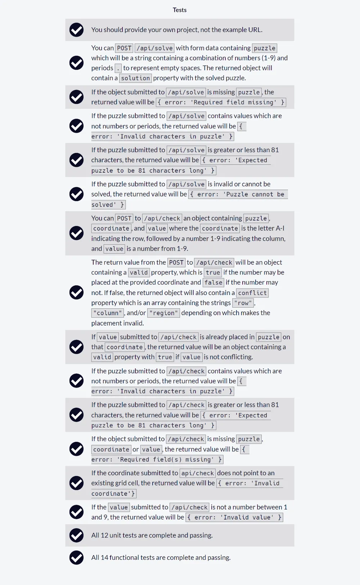

## Tests Requeridos

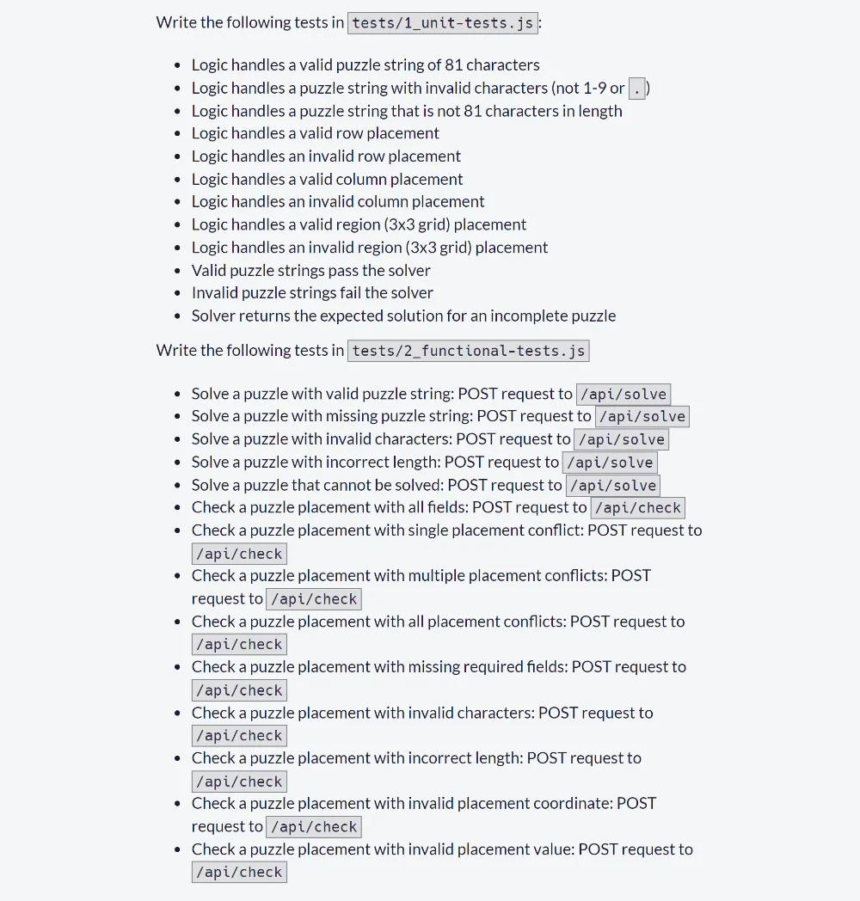

## Proyecto Aprobado

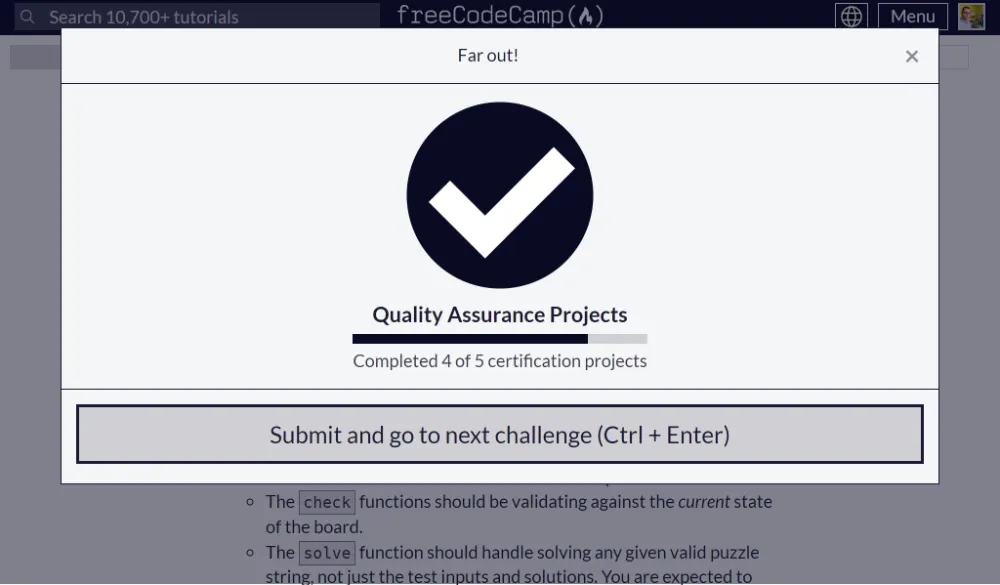

## Tests Requeridos Aprobados

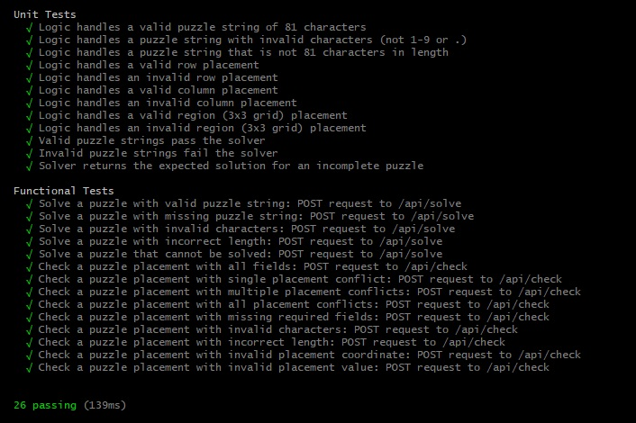

## Código de tests unitarios y funcionales

### 1. Tests Unitarios

#### 1.1. Logic handles a valid puzzle string of 81 characters

```js
test("Logic handles a valid puzzle string of 81 characters", (done) => {
  assert.equal(solver.validate(onePuzzleValid)[0], true);
  done();
});
```

#### 1.2.Logic handles a puzzle string with invalid characters (not 1-9 or .)

```js
test("Logic handles a puzzle string with invalid characters (not 1-9 or .)", (done) => {
  assert.equal(solver.validate(onePuzzleInvalidCharacter)[0], false);
  done();
});
```

#### 1.3.Logic handles a puzzle string that is not 81 characters in length

```js
test("Logic handles a puzzle string that is not 81 characters in length", (done) => {
  assert.equal(solver.validate(onePuzzleNot81Characters)[0], false);
  done();
});
```

#### 1.4.Logic handles a valid row placement

```js
test("Logic handles a valid row placement", (done) => {
  const matrix = solver.puzzleMatrix(onePuzzleValid);
  assert.equal(solver.checkRowPlacement(matrix, 0, 1, 3), true);
  done();
});
```

#### 1.5.Logic handles an invalid row placement

```js
test("Logic handles an invalid row placement", (done) => {
  const matrix = solver.puzzleMatrix(onePuzzleValid);
  assert.equal(solver.checkRowPlacement(matrix, 0, 1, "2"), false);
  done();
});
```

#### 1.6.Logic handles a valid column placement

```js
test("Logic handles a valid column placement", (done) => {
  const matrix = solver.puzzleMatrix(onePuzzleValid);
  assert.equal(solver.checkColPlacement(matrix, 0, 1, "4"), true);
  done();
});
```

#### 1.7.Logic handles an invalid column placement

```js
test("Logic handles an invalid column placement", (done) => {
  const matrix = solver.puzzleMatrix(onePuzzleValid);
  assert.equal(solver.checkColPlacement(matrix, 0, 1, "9"), false);
  done();
});
```

#### 1.8.Logic handles a valid region (3x3 grid) placement

```js
test("Logic handles a valid region (3x3 grid) placement", (done) => {
  const matrix = solver.puzzleMatrix(onePuzzleValid);
  assert.equal(solver.checkRegionPlacement(matrix, 0, 1, "3"), true);
  done();
});
```

#### 1.9.Logic handles an invalid region (3x3 grid) placement

```js
test("Logic handles an invalid region (3x3 grid) placement", (done) => {
  const matrix = solver.puzzleMatrix(onePuzzleValid);
  assert.equal(solver.checkRegionPlacement(matrix, 0, 1, "1"), false);
  done();
});
```

#### 1.10.Valid puzzle strings pass the solver

```js
test("Valid puzzle strings pass the solver", (done) => {
  const isValid = solver.validate(onePuzzleValid)[0];
  const matrix = solver.puzzleMatrix(onePuzzleValid);
  const isSolvedValidMatrix = isValid && solver.solve(matrix);
  assert.equal(isSolvedValidMatrix, true);

  done();
});
```

#### 1.11.Invalid puzzle strings fail the solver

```js
test("Invalid puzzle strings fail the solver", (done) => {
  const isValid = solver.validate(onePuzzleInvalidCharacter)[0];
  const matrix = solver.puzzleMatrix(onePuzzleInvalidCharacter);
  const isSolvedValidMatrix = isValid && solver.solve(matrix);
  assert.equal(isSolvedValidMatrix, false);
  done();
});
```

#### 1.12.Solver returns the expected solution for an incomplete puzzle

```js
test("Solver returns the expected solution for an incomplete puzzle", (done) => {
  const matrix = solver.puzzleMatrix(onePuzzleValid);
  const isSolved = solver.solve(matrix);
  assert.deepEqual(matrix.map((row) => row.join("")).join(""), onePuzzleSolved);
  done();
});
```

### 2. Tests Funcionales

#### 2.1. Solve a puzzle with valid puzzle string: POST request to /api/solve

```js
test("Solve a puzzle with valid puzzle string: POST request to /api/solve", (done) => {
  chai
    .request(server)
    .keepOpen()
    .post("/api/solve")
    .send({
      puzzle: onePuzzleValid,
    })
    .end((err, res) => {
      assert.equal(res.status, 200);
      assert.equal(res.body.solution, onePuzzleSolved);
      done();
    });
});
```

#### 2.2.Solve a puzzle with missing puzzle string: POST request to /api/solve

```js
test("Solve a puzzle with missing puzzle string: POST request to /api/solve", (done) => {
  chai
    .request(server)
    .keepOpen()
    .post("/api/solve")
    .send({
      puzzle: "",
    })
    .end((err, res) => {
      assert.equal(res.status, 200);
      assert.equal(res.body.error, "Required field missing");
      done();
    });
});
```

#### 2.3.Solve a puzzle with invalid characters: POST request to /api/solve

```js
test("Solve a puzzle with invalid characters: POST request to /api/solve", (done) => {
  chai
    .request(server)
    .keepOpen()
    .post("/api/solve")
    .send({
      puzzle: onePuzzleInvalidCharacter,
    })
    .end((err, res) => {
      assert.equal(res.status, 200);
      assert.equal(res.body.error, "Invalid characters in puzzle");
      done();
    });
});
```

#### 2.4.Solve a puzzle with incorrect length: POST request to /api/solve

```js
test("Solve a puzzle with incorrect length: POST request to /api/solve", (done) => {
  chai
    .request(server)
    .keepOpen()
    .post("/api/solve")
    .send({
      puzzle: onePuzzleNot81Characters,
    })
    .end((err, res) => {
      assert.equal(res.status, 200);
      assert.equal(res.body.error, "Expected puzzle to be 81 characters long");
      done();
    });
});
```

#### 2.5. Solve a puzzle that cannot be solved: POST request to /api/solve

```js
test("Solve a puzzle that cannot be solved: POST request to /api/solve", (done) => {
  chai
    .request(server)
    .keepOpen()
    .post("/api/solve")
    .send({
      puzzle: onePuzzleCannotBeSolved,
    })
    .end((err, res) => {
      assert.equal(res.status, 200);
      assert.equal(res.body.error, "Puzzle cannot be solved");
      done();
    });
});
```

#### 2.6.Check a puzzle placement with all fields: POST request to /api/check

```js
test("Check a puzzle placement with all fields: POST request to /api/check", (done) => {
  chai
    .request(server)
    .keepOpen()
    .post("/api/check")
    .send({
      puzzle: onePuzzleValid,
      coordinate: "a1",
      value: "1",
    })
    .end((err, res) => {
      assert.equal(res.status, 200);
      assert.equal(res.body.valid, true);
      done();
    });
});
```

#### 2.7.Check a puzzle placement with single placement conflict: POST request to /api/check

```js
test("Check a puzzle placement with single placement conflict: POST request to /api/check", (done) => {
  chai
    .request(server)
    .keepOpen()
    .post("/api/check")
    .send({
      puzzle: onePuzzleValid,
      coordinate: "a2",
      value: "4",
    })
    .end((err, res) => {
      assert.equal(res.status, 200);
      assert.equal(res.body.valid, false);
      assert.equal(res.body.conflict.length, 1);
      assert.equal(res.body.conflict[0], "row");
      done();
    });
});
```

#### 2.8.Check a puzzle placement with multiple placement conflicts: POST request to /api/check

```js
test("Check a puzzle placement with multiple placement conflicts: POST request to /api/check", (done) => {
  chai
    .request(server)
    .keepOpen()
    .post("/api/check")
    .send({
      puzzle: onePuzzleValid,
      coordinate: "a2",
      value: "1",
    })
    .end((err, res) => {
      assert.equal(res.status, 200);
      assert.equal(res.body.valid, false);
      assert.equal(res.body.conflict.length, 2);
    });
  done();
});
```

#### 2.9.Check a puzzle placement with all placement conflicts: POST request to /api/check

```js
test("Check a puzzle placement with all placement conflicts: POST request to /api/check", (done) => {
  chai
    .request(server)
    .keepOpen()
    .post("/api/check")
    .send({
      puzzle: onePuzzleValid,
      coordinate: "a2",
      value: "2",
    })
    .end((err, res) => {
      assert.equal(res.status, 200);
      assert.equal(res.body.valid, false);
      assert.equal(res.body.conflict.length, 3);
    });
  done();
});
```

#### 2.10.Check a puzzle placement with missing required fields: POST request to /api/check

```js
test("Check a puzzle placement with missing required fields: POST request to /api/check", (done) => {
  chai
    .request(server)
    .keepOpen()
    .post("/api/check")
    .send({
      puzzle: onePuzzleValid,
    })
    .end((err, res) => {
      assert.equal(res.status, 200);
      assert.equal(res.body.error, "Required field(s) missing");
      done();
    });
});
```

#### 2.11.Check a puzzle placement with invalid characters: POST request to /api/check

```js
test("Check a puzzle placement with invalid characters: POST request to /api/check", (done) => {
  chai
    .request(server)
    .keepOpen()
    .post("/api/check")
    .send({
      puzzle: onePuzzleInvalidCharacter,
      coordinate: "a2",
      value: "2",
    })
    .end((err, res) => {
      assert.equal(res.status, 200);
      assert.equal(res.body.error, "Invalid characters in puzzle");
      done();
    });
});
```

#### 2.12.Check a puzzle placement with incorrect length: POST request to /api/check

```js
test("Check a puzzle placement with incorrect length: POST request to /api/check", (done) => {
  chai
    .request(server)
    .keepOpen()
    .post("/api/check")
    .send({
      puzzle: onePuzzleNot81Characters,
      coordinate: "a2",
      value: "2",
    })
    .end((err, res) => {
      assert.equal(res.status, 200);
      assert.equal(res.body.error, "Expected puzzle to be 81 characters long");
      done();
    });
});
```

#### 2.13.Check a puzzle placement with invalid placement coordinate: POST request to /api/check

```js
test("Check a puzzle placement with invalid placement coordinate: POST request to /api/check", (done) => {
  chai
    .request(server)
    .keepOpen()
    .post("/api/check")
    .send({
      puzzle: onePuzzleValid,
      coordinate: "ap9",
      value: "2",
    })
    .end((err, res) => {
      assert.equal(res.status, 200);
      assert.equal(res.body.error, "Invalid coordinate");
      done();
    });
});
```

#### 2.14.Check a puzzle placement with invalid placement value: POST request to /api/check

```js
test("Check a puzzle placement with invalid placement value: POST request to /api/check", (done) => {
  chai
    .request(server)
    .keepOpen()
    .post("/api/check")
    .send({
      puzzle: onePuzzleValid,
      coordinate: "a2",
      value: "10",
    })
    .end((err, res) => {
      assert.equal(res.status, 200);
      assert.equal(res.body.error, "Invalid value");
      done();
    });
});
```

## Screenshots

### 1. Home Page Initial Load

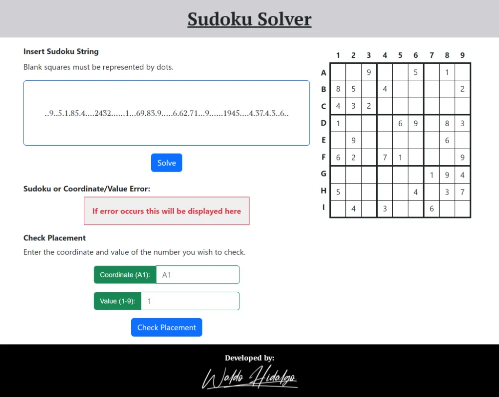

### 2. Ejemplo de Sudoku Resuelto

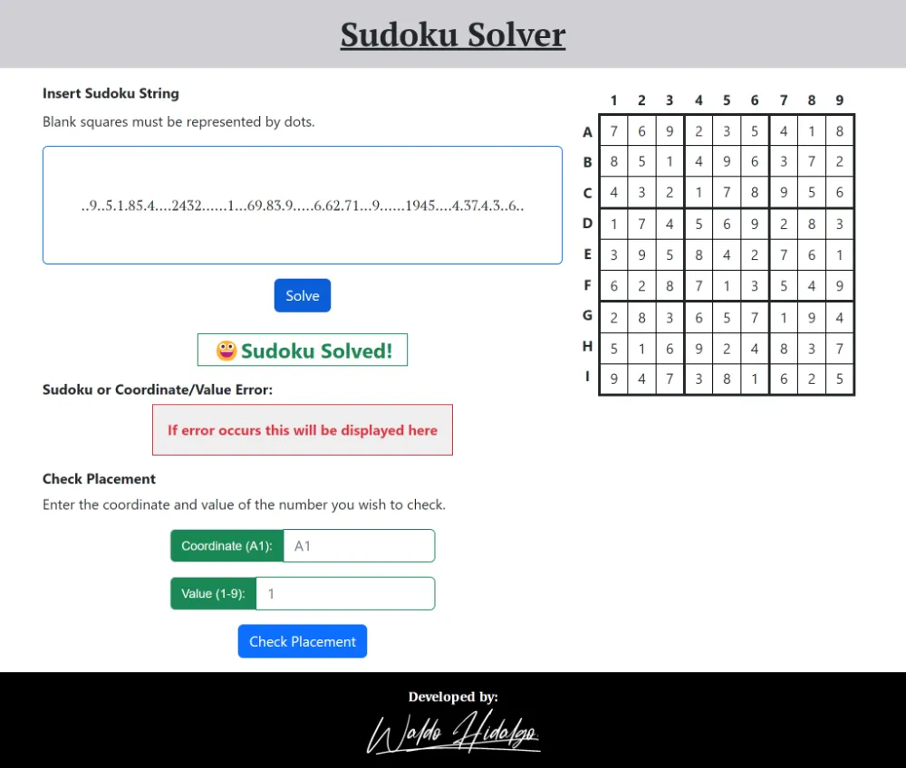

### 3. String Sudoku Inválido por Largo


### 4.String Sudoku Inválido por caracter no válido


### 5. String Sudoku Faltante

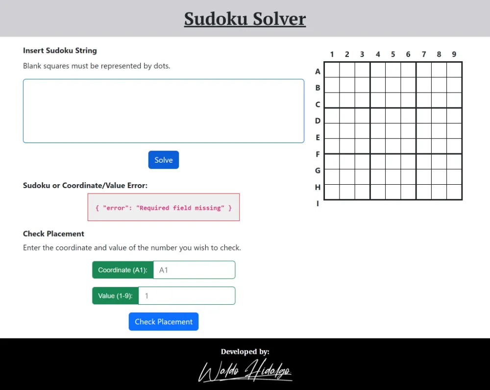

### 6. String Sudoku Inválido violación de Reglas de Sudoku

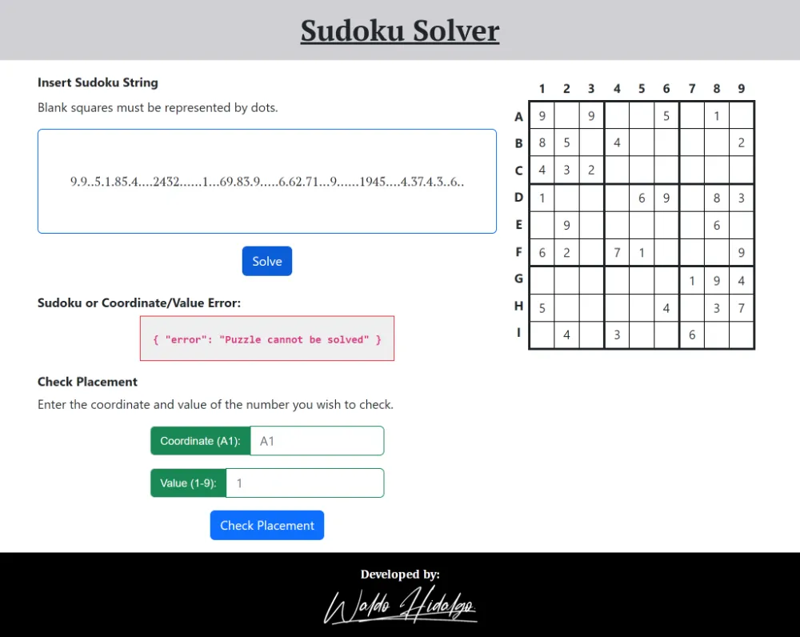

### 7. Valor en coordenada inválido por repetición en fila y columna

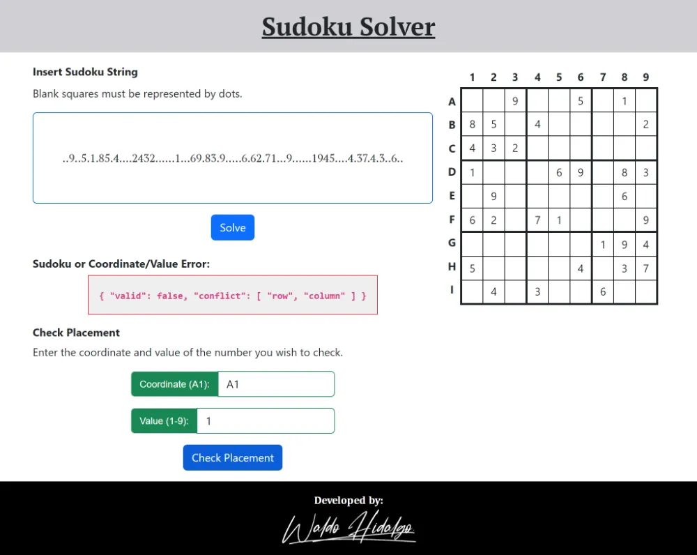

### 8. Valor en coordenada inválido por repetición en fila, columna y área

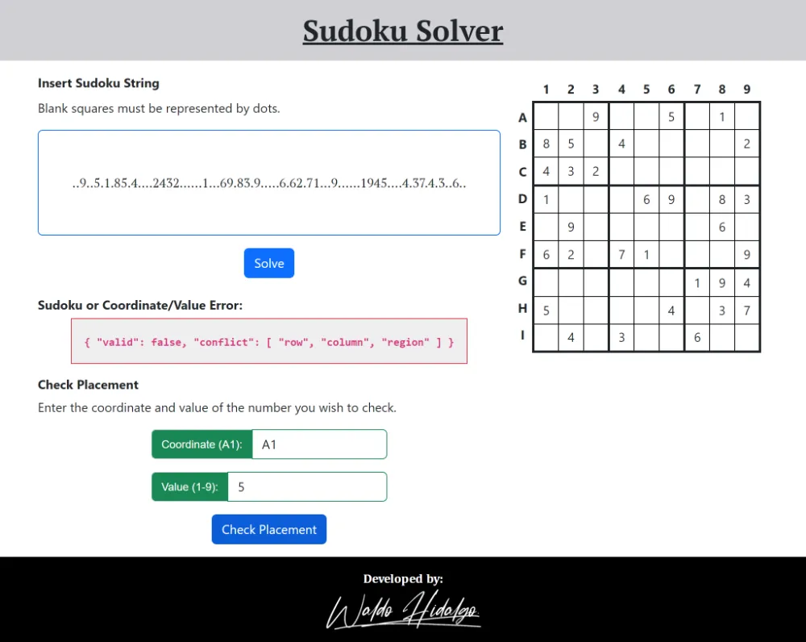

### 9. Coordenada ingresada inválida

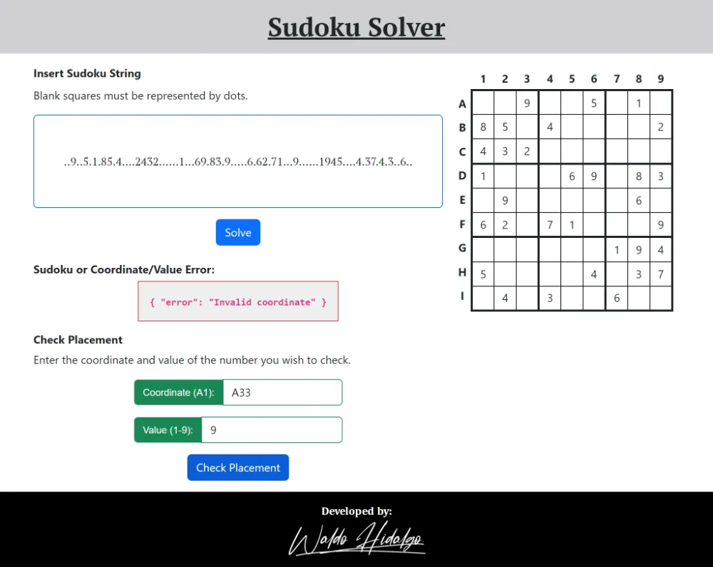

### 10. Valor ingresado inválido en coordenada

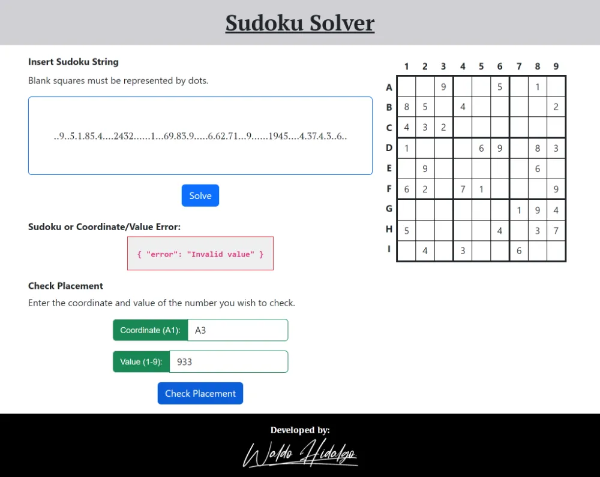

### 11. Valor y coordenada válido

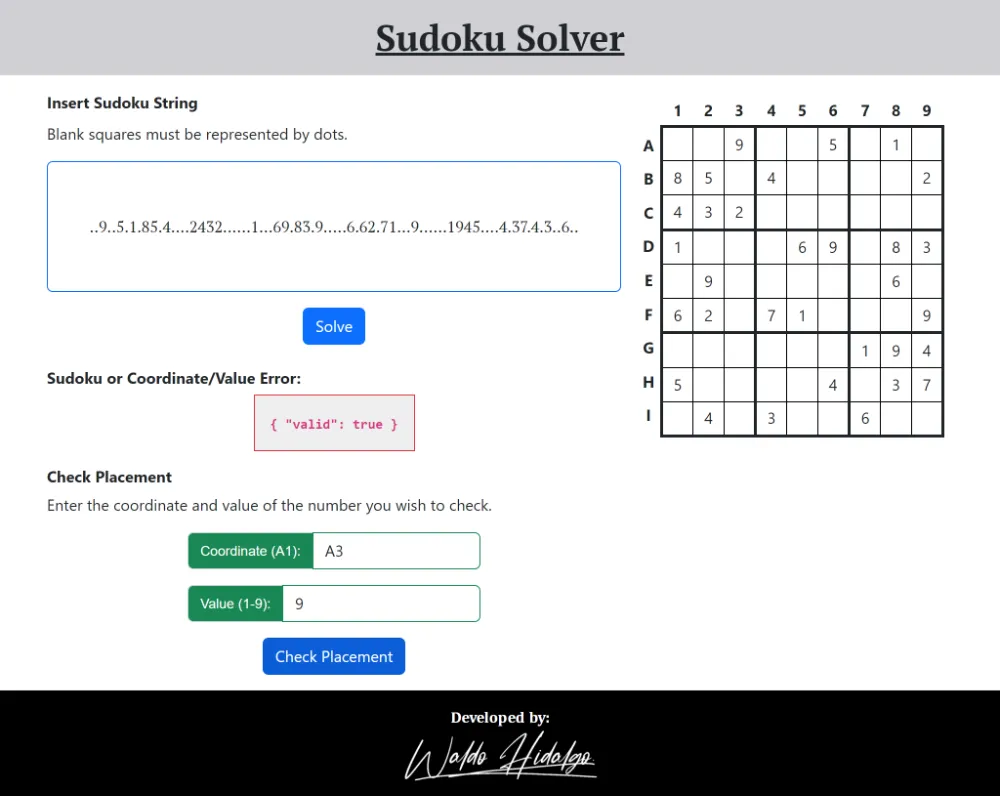
